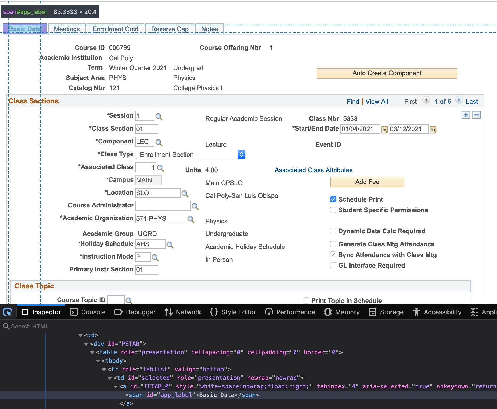
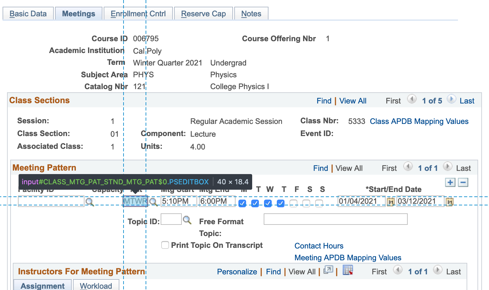

### tl;dr

* Using Python and Selenium to automate a large data entry job into PeopleSoft.
* It takes a CSV file of the needed data and automates its entry into PeopleSoft.
* Selenium is awesome, and it really works!
* If you have some arduous data entry task, I encourage you to look into Selenium to automate it.
* Hopefully this tutorial can help you get started.

# Using PeopleSoft

I've had to use PeopleSoft for part of my job (scheduling classes in a university physics department) for about 6 years now, and in this time have concluded that: *PeopleSoft is a curse on humanity*.  

I'm not even sure what "PeopleSoft" (PS) actually is, but the curse for me is the web-based user interface to CRUDing on a backend database that runs my organization (a large university). I actually feel sorry for anyone who uses PS (and a lot of people do). You can spot on a screen it a mile away. The tight, small fonts and little boxes littered all over the screen. There's no responsive behavior, and it's uninviting, slow and unintuitive. There's no modern look to the elements (a la Bootstrap, etc.) and some boxes are too small for content they are to hold. The fonts used look like the ones on the original 80x25 IBM PC.

Here's for a box for example, that is supposed to hold five letters, one for each a day of the work-week:


Changes to PS are impossible to implement, because it is typically used by large organizations requring many levels of committees for approving fixes. 

Some text-entry boxes require one to input data in a certain format, which could be eliminated with some simple form-data processing on the server side. 

An as example, suppose I need to place a class in room 101 of building 180. How about typing in 180-101? 


Nope. How about 180-0101?

>

No again. How about 180 -0101?

>


Ok, finally. Everyone using PS at my organization has to type an extra space, and zero pad the room number. Everyone, everytime. Wow.


Then there's the dreaded spinners and calls to the server with each focus change for a every entry element (=slow). 


(Note: These annoying spinners will turn out to be very useful later on.)

The point of this rant is that if PS is so unfriendly for humans to use, maybe it is better suited to be driven by another computer? Hmmm....


# My data for PS

I must use PS to tell the university about my local department's scheduling plans for upcoming terms (what classes, where, times of day, intructor names, etc.).  Once in a backend database, the data then goes to student registration pages (also some derivative of PS), payroll, tuition bills, and some data visualization tools, etc. 

Internally, as I create my department's schedule, I end up with a CSV file containing all information about my department's upcoming course offerings. Something like this:

```
ASTR-101,01,01,LEC,053 -0215,MTWR,03:10 PM,04:00 PM,Y,70,E,last1,first1,emplid1,,
ASTR-102,01,01,LEC,,MTWR,,,Y,120,E,last2,first2,emplid2,,
ASTR-102,02,02,LEC,053 -0206,MTWR,04:10 PM,05:00 PM,Y,70,E,last3,first3,emplid3,,
ASTR-324,01,01,LEC,053 -0215,MTWR,01:10 PM,02:00 PM,Y,48,E,last4,first4,emplid4,,
GEOL-102,01,01,LEC,,MW,07:40 AM,09:00 AM,Y,120,E,last5,first5,emplid5,,
GEOL-102,02,9999,DIS,180 -0233,W,10:10 AM,11:00 AM,Y,30,N,last6,first6,emplid6,,
...
...
...
```
This goes on typically for about 200 lines.  Here you can see classes, week days, times, etc. Making this CSV is also a lot of work, but more so on the side of planning.  (The genetic algorithm I used to do this planning is another topic.)  Nonetheless, this is our schedule, and it must go into PS by a certain deadline four times a year, once for each term. 

Yes a large portion of a previous term's data is rolled over, but with all of the small changes typically needed, this rollover is only marginally useful.  There is still a lot work to be done.  Further, data views in PS are non-existent, so you are forced to come up with your own. In my case, it's graphical drawings of rooms with classes tiled in them, created using scheduling software of my own design.  So, when off into my own views, staying synced with PS becomes a huge issue. If I click to drag a class to an hour later in the day (and maybe do this countless times to any number of classes) in my planning phase, how does this make it back into PS?

When I first started this, I would print my final plan on paper, get out a ruler for keeping track, and type each line into PS. Usually to the tune of 180 classes or so. I know this is crazy, but in large organizations, printing data on one computer to enter into another computer is pretty common. 

At one point a while back, I said "enough."  For at least a week, I was contemplating aiming a video feed at my computer screen, and using OpenCV, to control an Arudino Leonardo simulating mouse clicks and keystrokes to input my data.  Luckily, a friend who does web-development once showed me a testing tool called "Selenium," so I decided to take a look. It even says on their website "Boring web-based administration tasks can (and should) also be automated..."  

This repository shows how I use Selenium to read in my CSV and type it into PS for me. As long as PS was written for robots to use, let's just let a robot use it then!

# Selenium

[Selenium](https://www.selenium.dev) is some core of all of the popular web-browsers (Chrome, Firefox, Safari) that can be controlled via software. That means all clicks, fill-in boxes, 'save' buttons and the like can be triggered using software. I use the Python 'bindings' for it, and somehow when I run my Python script, a Chrome browser opens up that says "Chrome is being controlled by automated test software." This means two things: 1) The host server (i.e. PS) doesn't know anything unsual is going on--it's just Chrome afterall and 2) I don't click to control this browser; the Python script does.


## Let's make a click

If you're curious, [the documentation](https://www.selenium.dev/documentation) for Selenium is excellent. This first Python example shows you the general plan:

```python
from selenium import webdriver
from selenium.webdriver.common.by import By
from selenium.webdriver.common.keys import Keys
from selenium.webdriver.support.ui import WebDriverWait
from selenium.webdriver.support.expected_conditions import presence_of_element_located
from selenium.webdriver.support import expected_conditions as EC

#This example requires Selenium WebDriver 3.13 or newer
with webdriver.Chrome('/path/to/chromedriver') as driver:
    wait = WebDriverWait(driver, 10)
    driver.get("https://google.com/")
    driver.find_element(By.NAME, "q").send_keys("cheese" + Keys.RETURN)
    first_result = WebDriverWait(driver, 5).until(EC.presence_of_element_located((By.CSS_SELECTOR , "h3>div")))
    print(first_result.get_attribute("textContent"))
```

Casually browsing the code, you can see how the page ```https://google.com/``` is requested.  Google's search box is famously referred in the underlying HTML by the same of ```q```. You tell Selenium to find this element in the HTML data on Google's main search page (```find_element```).  Once found, into this element you have Selenium type, via the ```send_keys``` function, the text ```cheese``` followed by return. In other words, you are having Selenium search for the word ```cheese```--and you'll see it all happen in the automated Chrome view that the script will pop up on your screen.

Given lags and general random time delays on the web, you don't expect any server pages to be loaded instantly, so you tell the web-driver to always wait 10 seconds for result before timing out. You can do whatever you wish with the result of your search query. In this case, the HTML fragment ```h3>div``` is waited for.  This starts the "Show More" clickable tag on the Google search results page. Running this code with ```python example.py``` will result, via the final line ```print(first_result.get_attribute("textContent"))``` with the text ```Show More``` being displayed in your terminal. 

Congratulations: you just did an automated Google search and fished something out of the search results.

## Automating

Let's go a step further, and have Selenium click on the "Next" link, to take us to the 2nd page of search results.  To do this, you'll have to fish through the search page's html code and try to figure out how the "Next" link works.

To help, I downloaded the "developer edition" of the Firefox browser. It has a "web inspector" which you can find here:


When this is active the browser looks like this


Where you can now peek down in the HTML code of Google's home page to see what part of it is generating the search box. In this case, it's

```html
<input class="gLFyf gsfi" maxlength="2048" name="q" type="text" jsaction="paste:puy29d" aria-autocomplete="both" aria-haspopup="false" autocapitalize="off" autocomplete="off" autocorrect="off" autofocus="" role="combobox" spellcheck="false" title="Search" value="" aria-label="Search" data-ved="0ahUKEwjywISjl_XpAhV0HjQIHVhCC1oQ39UDCAY">
```

You can clearly see the ```name="q"``` tag, which is the same "q" we had Selenium type "cheese" into above. 

The "next" link is similarly revealed here:


Thus, we can look for an element whose HTML ```id``` is ```pnnext``` (see the ```<a id="pnnext" ...>``` text?) and tell Seleniun to click on it via

```python
elem = driver.find_element_by_id("pnnext")
elem.click();
```

This in a nutshell, is what you do with Selenium: direct it to load pages from the web, then look for things of interest to you in the text of pages read back into variables, then act on them. This means fill in text-boxes, click on links, etc.

My plan is then to use Selenium to log me into my enterprise and navigate to the PS data entry area. From there, the contents of my CSV file will be read and typed into the proper places into the PS form.

# Automating PeopleSoft


## Log-in first

I don't think there's a way of having Selenium "take over" a web browser session that I may have started by hand. So I have to log on to my enterprise first, but that's OK, it's good warm-up for things to come. So my code started like this:

```python
from selenium import webdriver
import selenium.webdriver.support.ui as ui
from selenium.webdriver.common.keys import Keys
from selenium.webdriver.common.by import By
from selenium.webdriver.support.ui import WebDriverWait
from selenium.webdriver.support import expected_conditions as EC
from selenium.webdriver.support.ui import Select
import time
import csv
import sys


if len(sys.argv) != 3:
	print "Usage: autops username password"
	exit()

username = sys.argv[1]
password = sys.argv[2]

start = time.time()
browser = webdriver.Chrome('/path/to/chromedriver')
#browser = webdriver.Safari()
#browser.maximize_window()
browser.get('https://my.enterprise.web.address')
handle0 = browser.current_window_handle
print handle0

fill_in_by_id('username',username)
time.sleep(1)
fill_in_by_id("password",password)
time.sleep(1)

```

Required imports at the top, then the code begins.  I didn't want to hardcode by username and password, so I pass those in as command line parameters, as in 

```python autops username password```

(I know, I know, passwords on the command line.)  Next I start a timer (to get a sense for how long a job runs for) and open the webdriver for Chrome (Safari, Firefox, etc. drivers are also available). There will also be a lot of prints to stdout, to help me keep track of what's going on.

So I pull in my enterprise login page, then fill in my username and password using a function called `fill_in_by_id.` This is a function I wrote that
will fill in a HTML text box uniquely identified with the ```id=``` tag. As above, I identified the tag using the Firefox Developer browser. Here is the
function `fill_in_by_id`:

```python
def fill_in_by_id(elem_id,text):
	elem = wait_for_by_id(elem_id)
	elem.clear()
	elem.send_keys(text)
	elem.send_keys(Keys.TAB)
	time.sleep(0.5)
```

First, we wait for the element "by id" to appear in the page, clear it (literally, remove any text that may be in it), then send out the needed string (as if typed). It is
important in PS to simulate a tab key press at the end of all such input. It took a while to figure out that this always forces the text field to reconcile with the server (it brings up a spinner). It then pauses for 0.5 seconds. Yes, when using Selenium, get used to putting in Python's `time.sleep()` here and there to slow your script down, so it won't race past any relatively slower server you may be talking to.

The `wait_for_by_id()` function is also custom, and looks like this:

```python
def wait_for_by_id(elem_id):
	print "waiting for id "+elem_id
	try:
		elem = WebDriverWait(browser, 10).until(EC.visibility_of_element_located((By.ID, elem_id)))
	except:
		print "could not find "+elem_id+". Please click on it."
		x=raw_input("Press [Return] when done...")
		elem = False

	return(elem)
```

As you can see, we tell the web-driver to wait 10 seconds until the webpage we're loading detects the HTML element we seek becoming visible.  A bit of a failsafe in also
included using the `try/except` construct. I found PS to be a wildly erratic system in the timing of its responses. This version of `wait_for_by_id()` seem to work best and the `except` allows us to recover/continue a lengthy input run in the case of some PS spasm.

You should be able to use this plan to log in to your enterprise, as needed. Don't forget to find your "login" button, so Selenium can "click it" to log you in. Mine is clicked using:

```python
elem = browser.find_element_by_name("_eventId_proceed")
elem.click();
````

My login button has a HTML name of `"_eventId_proceed`. The Selenium function `find_element_by_name()` will find this button, then the `.click()` will simulate the click.

# Navigating

Once in, you likely need to navigate to your data entry area. For me, this involves a few clicks through my main univeristy portal (portal=word from the 90s). First, I needed to click on a link with the HTML id of `tabLink_u21l1s5`.  Thus, a line like this:

```python
click_on_by_id("tabLink_u21l1s5")
```

I found this however, to be unreliable when dealing with PS. In other words, sometimes Selenium would just sit, apparently unable to find the link with this id.  You may run into trouble like this, likely because elements are in differenet iframes. (I never quite understood how Selenium handles iframes. I think it isolates HTML entities into each, meaning you can't directly "see" elements in a iframe unless you explicitly change into it.)

Nonetheless, here is `click_on_by_id()`:

```python
def click_on_by_id(elem_id):
	elem = wait_for_by_id(elem_id)
	if elem != False:
		elem.click()
```

You see a call again to `wait_for_by_id()`, which does a `.click` instead of a `send_keys()`. This is the only difference between doing a text fill and a click in Selenium.

It turns out that a more exacting way of finding elements in a page is using its "xpath." These are step by step paths into the DOM object to unambiguously point to an HTML element in a document.  We defaulted to using xpaths throughout this work, as they seem more reliable in finding elements, particularly in the vast PS jungle.  (PS jungle: At some point, I even started feeling sorry for *browsers* used to interact with PS.) Xpaths, however are less robust in the long term, as any code change on the end of PS will break its use. (But I don't think PS changes very much!)

The Firefox Developer will show you such xpaths. Just right click on an element HTML down in the code box, and you can copy out the xpath to an element. 


In this case, it came out to be
`//*[@id="tabLink_u21l1s5"]'`. So, yes, we have this pair of functions coded, as xpaths are supported by Selenium:

```python
def wait_for_by_xpath(xpath):
	print "waiting for xpath "+xpath
	try:
		elem = WebDriverWait(browser, 10).until(EC.visibility_of_element_located((By.XPATH, xpath)))
	except:
		print "could not find "+xpath+". Please click on it."
		x=raw_input("Press [Return] when done...")
		elem = False

	return(elem)


def click_on_by_xpath(xpath):
	elem = wait_for_by_xpath(xpath)
	if elem != False:
		elem.click()
```


So, the next call out is a line like this

```python
click_on_by_xpath('//*[@id="tabLink_u21l1s5"]')
```

To make that first click into the portal.  The next click in our portal is a launch into PS, having this xpath `/html/body/div/div/div[3]/div/div/div[5]/div[2]/div/div[2]/div/div[3]/div/div[1]/h2[1]/a'` so we do this:

```python
click_on_by_xpath('/html/body/div/div/div[3]/div/div/div[5]/div[2]/div/div[2]/div/div[3]/div/div[1]/h2[1]/a')
```

This second click essentially brings us to the main PS starting point, as it is connected to the university portal. You can kind of see what xpaths are: a lineage of stops to an element in a page.  In this case, look in the html, then to the body, then into some divs, etc. There are many tutorials and videos on xpaths. I found the xpath tutorials by [this Youtuber](https://www.youtube.com/user/naveenanimation20) to be helpful.

# Getting the CSV into PS

Now for the big moment. With some basics of Selenium are covered, it's now time to tackle getting the CSV data auto-typed into PS. The CSV file above has a header describing each column, that looks like this:

```class,section_number,assoc_number,type,room,days,start,end,print,ecap,enroll,last,first,emplid,topic,notenbr```

In terms of scheduling classes, these are fields that need to go into various boxes and dropdowns in the dreaded "class entry" form in PS.  Configuring a class has many boxes, all needing to be filled in with something from one of these columns. The fields in PS are also spread across multiple tabs. Here we go.

To begin Selenium takes me to a class entry form that looks like this



Once again, I used the Firefox Developer to find xpaths or IDs for all boxes, dropdowns, and tabs I would be needing. This first tab for example has the id `ICTAB_0`. The "Class section" (id=`CLASS_TBL_CLASS_SECTION$0"`) and "Associated class" (id=`CLASS_TBL_SSR_COMPONENT$0`) boxes, for example, are in columns 2 and 3 of my CSV file.

The tab labeled "Meetings" (id=`ICTAB_1`) has historically been the killer one to deal with, as it contains the boxes for start, end, and days a class meets. Manually entering data into this form is so arduous and error prone. All of the small details, no formatting help from the web-interface, and spinners to wait for after focus loss in each field.  This is all part of "the curse."



For entering a whole line from the CSV into this combinations of tabs, etc. a function called `csv_fill()` was written as:

```python
def csv_fill(file_name,class_prefix,class_number):
	with open(file_name) as csv_file:
	    the_file = csv.DictReader(csv_file, delimiter=',')
	    for row in the_file:
	    	if row['class'].lower() == (class_prefix + '-' + class_number).lower():
	    		enter_class_info(row['section_number'],row['assoc_number'],row['type'],row['enroll'],row['print'],row['room'],row['days'],row['start'],row['end'],row['ecap'],row['emplid'],row['topic'],row['notenbr'])
	    		time.sleep(1)
	    		click_on_by_id('$ICField21$new$0$$0')
	    		time.sleep(1)
	    		wait_for_spinner()

	time.sleep(2) #wait for new form to load.
	delete_empty_class_form() #get rid of it
	time.sleep(2)
```

It works like this. Suppose I want to autofill in all "physics" classes, that have course prefix of `PHYS`, and suppose I want to put in all of the `121` numbered courses (PHYS-121 is physics for life-science majors). I would make a call to `csv_fill('courses.csv','PHYS','121')`.

As you can tell, this uses Python's CSV reader (DictReader) that is able to read in a CSV file and allow one to refer to a column by name, as given by column titles in the first row of the file.
The `if` statement checks for lines in the CSV that are related to the class I wish to enter, then calls `enter_class_info()` if so. This function is the big one that does the data entry:

```python
def enter_class_info(section_number,assoc_number,type,enroll_type,print_yn,room,days,start,end,ecap,emplid,topic,notenbr):
	time.sleep(1)
	click_on_by_id("ICTAB_0")
	time.sleep(1)
	wait_for_spinner()

	fill_in_by_id("CLASS_TBL_CLASS_SECTION$0",section_number.rjust(2,'0'))
	wait_for_spinner()
	
	#PS Quirk..won't accept class type without a save now

	click_save_button()

	if topic:
		fill_in_by_id("CLASS_TBL_CRS_TOPIC_ID$67$$0",topic)
		wait_for_spinner()


	fill_in_by_id("CLASS_TBL_SSR_COMPONENT$0",type)
	wait_for_spinner()

	if enroll_type == 'N':
		select_dropdown_by_id("CLASS_TBL_CLASS_TYPE$0","Non-Enrollment Section")
		wait_for_spinner()
	
	if print_yn == 'N':
		click_on_by_id("CLASS_TBL_SCHEDULE_PRINT$0")
		wait_for_spinner()

	fill_in_by_id("CLASS_TBL_ASSOCIATED_CLASS$0",assoc_number.rjust(2,'0'))
	wait_for_spinner();

	click_on_by_id("ICTAB_1")
	time.sleep(1)
	wait_for_spinner()

	if room:
		fill_in_by_id("CLASS_MTG_PAT_FACILITY_ID$0",room)
		wait_for_spinner()

	if days:
		fill_in_by_id("CLASS_MTG_PAT_STND_MTG_PAT$0",days)
		wait_for_spinner()

	if start:
		fill_in_by_id("CLASS_MTG_PAT_MEETING_TIME_START$0",start)
		wait_for_spinner()

	if end:
		fill_in_by_id("CLASS_MTG_PAT_MEETING_TIME_END$0",end)
		wait_for_spinner()

	if emplid:
		fill_in_by_id("CLASS_INSTR_EMPLID$0",emplid)
		wait_for_spinner()

	select_dropdown_by_id("CLASS_INSTR_GRADE_RSTR_ACCESS$0","Approve")
	wait_for_spinner()


	click_on_by_id("ICTAB_2")
	time.sleep(1)
	wait_for_spinner()

	fill_in_by_id("CLASS_TBL_ENRL_CAP$0",ecap)
	wait_for_spinner()
	fill_in_by_id("CLASS_TBL_ROOM_CAP_REQUEST$0",ecap)
	wait_for_spinner()
	fill_in_by_id("CLASS_TBL_WAIT_CAP$0","99")
	wait_for_spinner()

	if notenbr:
		click_on_by_id("ICTAB_4")
		time.sleep(1)
		wait_for_spinner()

		fill_in_by_id("CLASS_NOTES_CLASS_NOTE_NBR$0",notenbr)
		wait_for_spinner()

	click_on_by_id("ICTAB_0")
	time.sleep(1)
	wait_for_spinner()
```

You can follow along in the code, and see how I tell Selenium to click on tabs by their ID (or Xpaths--IDs seem to hold up in this case), then fill in boxes, checkboxes or dropdowns, based on what's in the given tab. 

Notice the `time.sleep(1)` lines.  After a lot of "cutting and trying" these made things work. Don't be shy about putting a lot of these in your own script at least initially. The biggest problem with Selenium is when the script somehow gets out of sync with the web-interaction. When in doubt, just make your script wait a bit. The ``if`` statements save navigation time if data for a given field is empty.

## Back to the spinner: wait_for_spinner()

As irritating as the spinners are to the human-based data-entry effort, they help enormously here to keep things on track in this automated mode. Why? I always tell Selenium to simulate a "tab" key after entering data. This forces PS to its needed "call-home" to its server. A spinner comes up when this happens.  After having a lot of trouble keeping the script in sync with the web-interactions, it dawned on me to always wait for the spinner to disappear before continuing. This meant PS is now happy with the last data entry.

It was rather comical to try to find the HTML ID for the spinner though, as it would come and go quickly. I had to enter some faux data in the Firefox Developer, then hover quickly to the place on the screen where the spinner appeared, then watch the code section for its name (all within a second or two). I think I finally nailed it down, as shown here. There's both a spinner and a "Saved..." message PS puts out, so I wait for both of them to clear (or become "invisible") before proceeding to the next data entry field.

```python
def wait_for_spinner():
	LONG_TIMEOUT = 30  # give enough time for loading to finish

	time.sleep(1)
	LOADING_ELEMENT_XPATH = "//*[@id='SAVED_win0']"
	print "waiting for spinner"
	WebDriverWait(browser, LONG_TIMEOUT).until(EC.invisibility_of_element_located((By.XPATH, LOADING_ELEMENT_XPATH)))

	LOADING_ELEMENT_XPATH = "//*[@id='WAIT_win0']"
	WebDriverWait(browser, LONG_TIMEOUT).until(EC.invisibility_of_element_located((By.XPATH, LOADING_ELEMENT_XPATH)))
	print "spinner done"
```

This really helped, and allows for very long data entry runs to work without a hitch. Although I still have a feeling I missed something, I do see the script pause while spinners appear, only to continue as soon as the spinner disappears again.


# Closing

This works!  And, it saves me not just time but, I can avoid the foot-dragging associated with this scheduling job, knowing that "dealing with PS" was coming.  I know once I get the planning done, the rest is just a matter of running this script. 

Here you can see it entering information for a class called PHYS-111 (watch the fast 'typing speed' and the spinners in the upper right corner!).

[](https://www.youtube.com/watch?v=dH0tezaQcVQ)


The full code for `autops.py` is in the `src` folder.  I generally approch data entry from an as needed basis, so my script has a lot of commented out blocks used for this and that. But all of my tasks are based on the core functions presented above. Python as a language is helpful for throwing together quick data-entry logic.

When doing manual entry, I would always have to do a "diff" between my CSV and PS to be sure I was in sync. This always took 24 hours, since after any data entry, I would have to wait a day for my university to "refresh" local tables from PS (PS does not have any data export functionality). I would then pull this local table, and diff it with my csv file, then go in and fix errors until the diff result was empty.  This would usually take a whole week (10 min of diffing, then another 24 hour wait to diff again).  There are no errors now, since what goes into PS comes right from the CSV (i.e. no human involved).

Also, in terms of staying synced, when I make changes, I just tell Selenium to delete what in PS and re-enter everything. I also usually run the script in blocks, having it only enter all classes of a given kind (i.e. all PHYS-121s, etc.) so I don't rely too much on seamless completion of a very large entry job.  All told now, it's just a computer talking to a computer, so it's no sweat for me. I had a grand plan of using Selenium to probe differences, but that got too messy.

